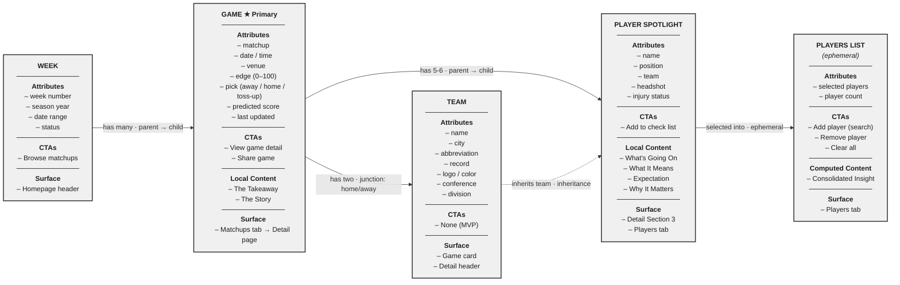

# OOUX Object Model Diagram — Before You Bet

## Legend

| Section | OOUX Meaning |
| --- | --- |
| **Attributes** | Data the object holds |
| **CTAs** | Call to Action — what the user can do with this object |
| **Local Content** | Nested content scoped to this object only |
| **Computed Content** | Generated dynamically from grouped child objects |
| **Surface** | Where this object appears in the UI |

## Relationship Key

| Line Style | OOUX Relationship | Meaning |
| --- | --- | --- |
| Solid → | Parent → Child | One parent owns many children |
| Solid → | Junction | Many-to-many with positional context |
| Solid → | Ephemeral selection | Object selected into a temporary container |
| Dashed ⇢ | Inheritance | Child inherits identity from another object |
